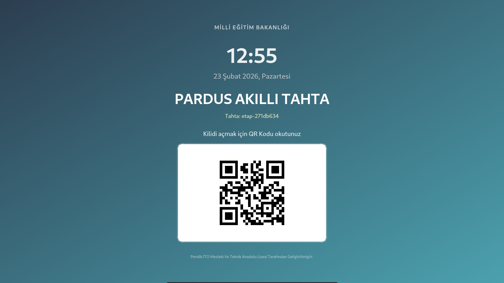
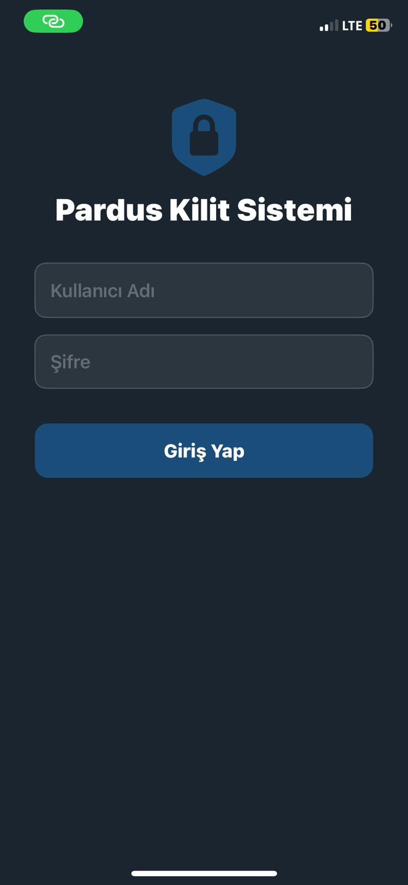

# Pardus Akıllı Tahta Kilit Sistemi

Okullardaki Pardus işletim sistemli akıllı tahtaları uzaktan yönetmek için geliştirilmiş açık kaynaklı bir sistem.

> Geliştirici: Selman Farisi CÜZDAN - Pendik İTO Mesleki Ve Teknik Anadolu Lisesi

---

## Nedir?

Her akıllı tahta, ekranında benzersiz bir **QR kod** gösterir. Yetkilendirilmiş kullanıcı mobil uygulamayla QR kodu okutarak sadece o tahtaya komut gönderebilir. Tek bir butona basarak tüm tahtaları açmak mümkün değildir — her komut QR doğrulaması ile hedeflenir.

```
[Tahta QR'ı]  →  [Mobil Uygulama]  →  [Sunucu]  →  [Sadece o tahta]
```

---

## Ekran Görüntüleri

| Tahta Kilit Ekranı | iOS Uygulama Girişi |
|:-----------------:|:------------------:|
|  |  |

---

## Özellikler

- Her tahta bağımsız olarak hedeflenir — tüm tahtalar aynı anda açılamaz/kapanamaz
- Rol tabanlı yetkilendirme: `superadmin`, `admin` ve `teacher`
- Öğretmenler yalnızca yetkilendirildikleri tahtaları kontrol edebilir
- Desteklenen komutlar: **Kilit Aç**, **Kilitle**, **Önceki Slayt**, **Sonraki Slayt**
- Tüm işlemler denetim logu (`audit_logs`) tablosuna kaydedilir
- Komut zaman aşımı (TTL): tahta 30 saniye içinde almazsa komut iptal edilir
- Hesap kilitleme: 5 başarısız girişten sonra 10 dakika kilitlenir
- Rate limiting: giriş (5/dk), kayıt (30/saat), polling (120/dk)
- Çok okul desteği: okul kodlarıyla çok kiracılı mimari

---

## Mimari

```
┌─────────────────────────────────────────┐
│         Flask Sunucu (:5000)            │
│  SQLite: users, boards, commands,       │
│          board_permissions, audit_logs  │
└──────────┬──────────────────┬───────────┘
           │                  │
    HTTP Polling (2sn)   REST API
           │                  │
┌──────────┴──────┐   ┌───────┴────────────┐
│  Tahta Ajanı    │   │  Mobil Uygulama    │
│  lock_system.py │   │  Android / iOS     │
│                 │   │                    │
│  - QR göster    │   │  - QR oku          │
│  - Komut bekle  │   │  - Komut gönder    │
│  - Uygula       │   │  - Admin paneli    │
└─────────────────┘   └────────────────────┘
```

---

## Bileşenler

| Bileşen | Teknoloji | Açıklama |
|---------|-----------|----------|
| `server/` | Python / Flask | Merkezi API, SQLite veritabanı, yetki yönetimi |
| `client/` | Python / PyQt5 | Tahtada çalışan kilit ekranı (generic) |
| `client_debian10/` | Python / PyQt5 | Debian 10 için tahta istemcisi |
| `client_debian11/` | Python / PyQt5 | Debian 11 için tahta istemcisi |
| `client_debian12/` | Python / PyQt6 | Debian 12 / Pardus için tahta istemcisi |
| `android/` | Kotlin / MVVM | QR okuma + komut gönderme (Android) |
| `ios/` | Swift / SwiftUI | QR okuma + komut gönderme (iOS) |
| `web/` | HTML / CSS / JS | Proje tanıtım ve indirme sayfası |
| `pwa/` | HTML / JS | Progressive Web App istemcisi |
| `docs/` | Markdown | Kurulum ve kullanım belgeleri |

---

## Klasör Yapısı

```
pardus_lock_system/
├── server/                  # Flask API sunucusu
│   ├── app.py               # Ana uygulama
│   ├── requirements.txt     # Python bağımlılıkları
│   └── templates/           # Web arayüzü şablonları
├── client/                  # Tahta kilit uygulaması (generic)
├── client_debian10/         # Debian 10 spesifik istemci
├── client_debian11/         # Debian 11 spesifik istemci
├── client_debian12/         # Debian 12 / Pardus spesifik istemci
├── android/                 # Android uygulaması
├── ios/                     # iOS uygulaması
├── web/                     # Tanıtım web sitesi
├── pwa/                     # Progressive Web App
├── docs/                    # Belgeler
├── .env.example             # Ortam değişkenleri örneği
└── README.md
```

---

## Kurulum

### Gereksinimler

- Python 3.9+
- Docker ve Docker Compose (önerilen)
- Pardus / Debian tabanlı akıllı tahtalar

### 1. Ortam Değişkenlerini Ayarlayın

```bash
cp .env.example .env
# .env dosyasını düzenleyip VDS_URL ve diğer değişkenleri doldurun
nano .env
```

### 2. Sunucuyu Docker ile Başlatın

```bash
cd server
docker-compose up -d
```

### 3. Tahta İstemcisini Kurun

Tahtanın Debian sürümüne göre ilgili klasörü kullanın:

```bash
# Debian 12 / Pardus için
cd client_debian12

# Ortam değişkenini ayarlayın
export VDS_URL=http://YOUR_SERVER_IP:5000

# Kurulum scriptini çalıştırın
bash install.sh
```

### 4. Mobil Uygulamayı Derleyin

**Android:**
```bash
cd android
# local.properties dosyasına SDK yolunu ekleyin
./gradlew assembleRelease
```

**iOS:**
```bash
cd ios
# Xcode ile açın ve Constants.swift içindeki defaultServerURL'i güncelleyin
open PardusLockApp.xcodeproj
```

---

## Konfigürasyon

### Sunucu Ortam Değişkenleri

| Değişken | Açıklama | Örnek |
|----------|----------|-------|
| `VDS_URL` | Flask API sunucu adresi | `http://192.168.1.100:5000` |
| `WEB_BASE_URL` | Web arayüzü baz URL'i | `http://192.168.1.100:4234` |
| `DEFAULT_ADMIN_PASSWORD` | İlk admin şifresi | *(boş = otomatik üretilir)* |
| `DEFAULT_SA_PASSWORD` | Süper admin şifresi | *(boş = otomatik üretilir)* |
| `CONTACT_EMAIL` | İletişim formu e-posta | `admin@example.com` |
| `CONTACT_PASSWORD` | Gmail uygulama şifresi | *(opsiyonel)* |

### İstemci Ortam Değişkenleri

| Değişken | Açıklama |
|----------|----------|
| `VDS_URL` | Bağlanılacak Flask sunucu adresi |

---

## Güvenlik

- Şifreler **werkzeug** ile hash'lenir (PBKDF2-HMAC-SHA256)
- SQL sorguları parameterized (SQL injection koruması)
- HTTPOnly + Strict SameSite cookie'ler
- Session fixation koruması
- Rate limiting (flask-limiter)
- Hesap kilitleme (5 başarısız girişten sonra)
- Tüm işlemler denetim loguna kaydedilir

> **Not:** Varsayılan yapılandırma HTTP kullanır. Üretim ortamında Nginx ile HTTPS (SSL/TLS) kurmanız **şiddetle tavsiye edilir**.

---

## Dökümantasyon

- [Kurulum Kılavuzu](docs/KURULUM.md)
- [Kullanım Kılavuzu](docs/KULLANIM.md)
- [iOS Derleme](docs/ios-derleme.md)

---

## Lisans

Bu proje açık kaynak olarak paylaşılmaktadır. Eğitim amaçlı kullanım serbesttir.
